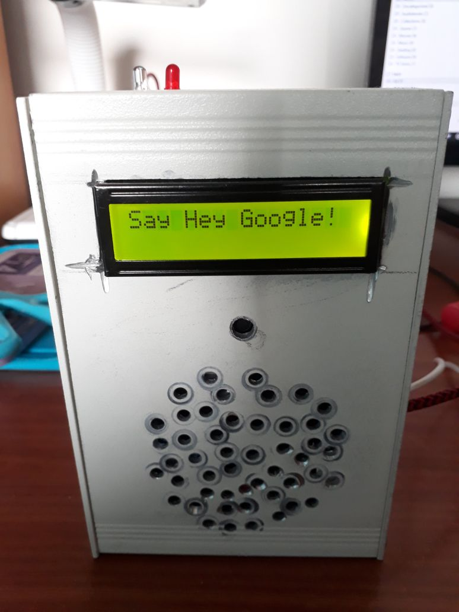
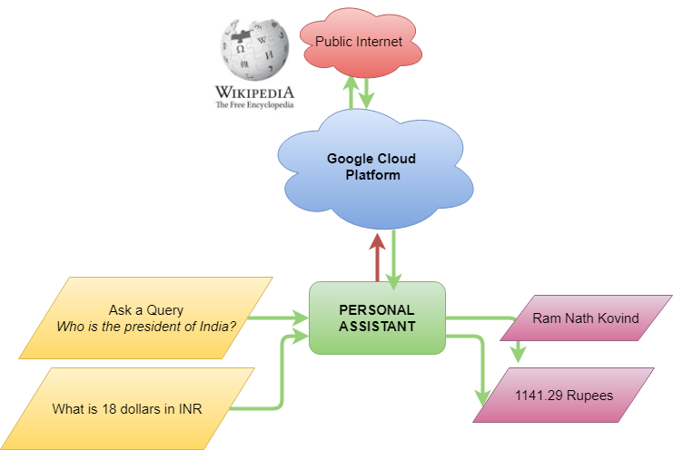
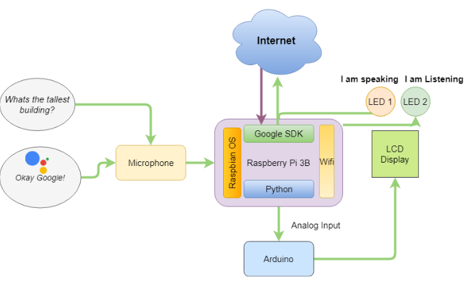

# Overview


“Personal Assistant “ the word itself means assistant working exclusively for one particular person. The major purpose of any automation system or artificial system is to reduce human labour, effort, time and errors due to their negligence. The major goal of this project is to design and implement a Personal Assistant and Intelligent Home Assistant in a same device (via world –wide-web) or even any mode of Internet-Access, which gives the ability to control your home appliances and to perform task or service for an individual.

These tasks or maybe services are based on user input, on location and also the ability to access information from variety of online sources. Various sensor based control for this application is being added to improve the security and also the ability to make more accurate decisions.    

> “It's your fiction that interests me. Your studies of the interplay of human motives and emotion.” ~ Isaac Asimov, I, Robot


<iframe width="560" height="315" src="https://www.youtube.com/embed/38F8jzOXrso?si=S_s_jK1Hj2QusaYi" title="YouTube video player" frameborder="0" allow="accelerometer; autoplay; clipboard-write; encrypted-media; gyroscope; picture-in-picture; web-share" referrerpolicy="strict-origin-when-cross-origin" allowfullscreen></iframe>

## How does it work?



It uses the power of Google Cloud Platform and it’s decade long research in speech – recognition to make it possible to implement voice enabled devices with ease.



Google Cloud Platform receives audio input from the Personal Assistant and uses Deep Neural Network to convert speech into text. Only then it is able to search for the answer. After finding the desired result, from Google’s Knowledge Graph, It starts to synthesize speech from text. Text-to-speech uses deep neural networks (AI) to synthesize a voice output. This is then sent via the internet to the personal assistant to give out the answer. All of this happens in seconds, due to today’s nature of internet speed and cloud computer’s increasing efficiency.

## Making the Assistant:
Step 1 - Preparation 
Installing Raspbian OS for Raspberry Pi.


*Raspberry Pi 3B+*

Step 2 - Update
Update OS and Kernel.
sudo apt-get update  
sudo apt-get install raspberrypi-kernel  
Restart Pi.

Step 3 - Speakers and Mic Setup
Choose the audio configuration according to your setup.
 USB DAC or USB Sound CARD users
```
sudo chmod +x /home/pi/GassistPi/audio-drivers/USB-DAC/scripts/install-usb-dac.sh  

sudo /home/pi/GassistPi/audio-drivers/USB-DAC/scripts/

install-usb-dac.sh

speaker-test 

```

For USB MIC AND AUDIO JACK 

```
sudo chmod +x /home/pi/GassistPi/audio-drivers/USB-MIC-JACK/scripts/usb-mic-onboard-jack.sh  
sudo /home/pi/GassistPi/audio-drivers/USB-MIC-JACK/scripts/usb-mic-onboard-jack.sh  
```

Test if Speakers are working
```
speaker-test  
Restart Pi
speaker-test -t wav
```

After the audio setup is completed.
Step 4 - Installing Google Assistant SDK
Register at Google Developers
 > Register the device

Obtain the credentials.json file.
Place the credentials.json file in/home/pi directory 
Installing Google Assistant
Make installers executable 
```
	sudo chmod +x /home/pi/GassistPi/scripts/gassist-installer-pi3.sh
```
Execute them
```
sudo  /home/pi/GassistPi/scripts/gassist-installer-pi3.sh 
```
Authorise by entering the Auth Token
After successful authentication the script will install necessary dependencies.

And voila! It should start working... 

> Now, Okay Google...