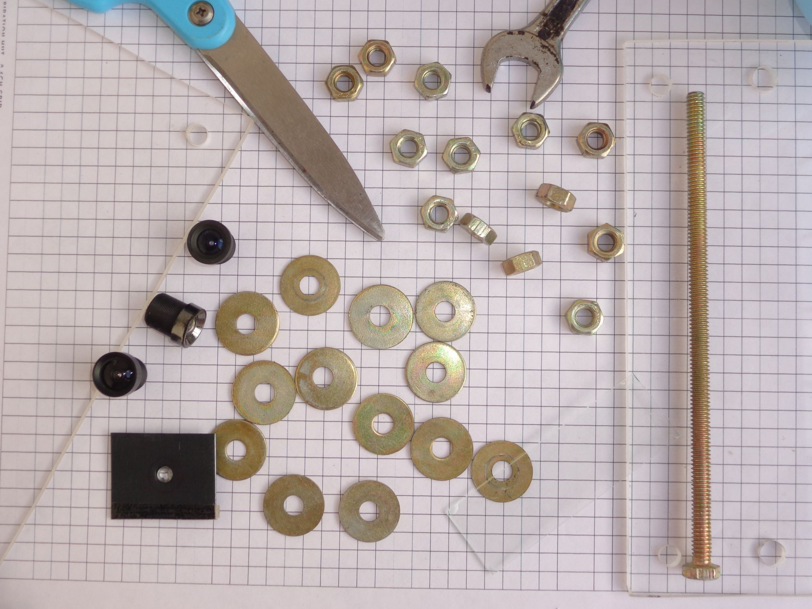
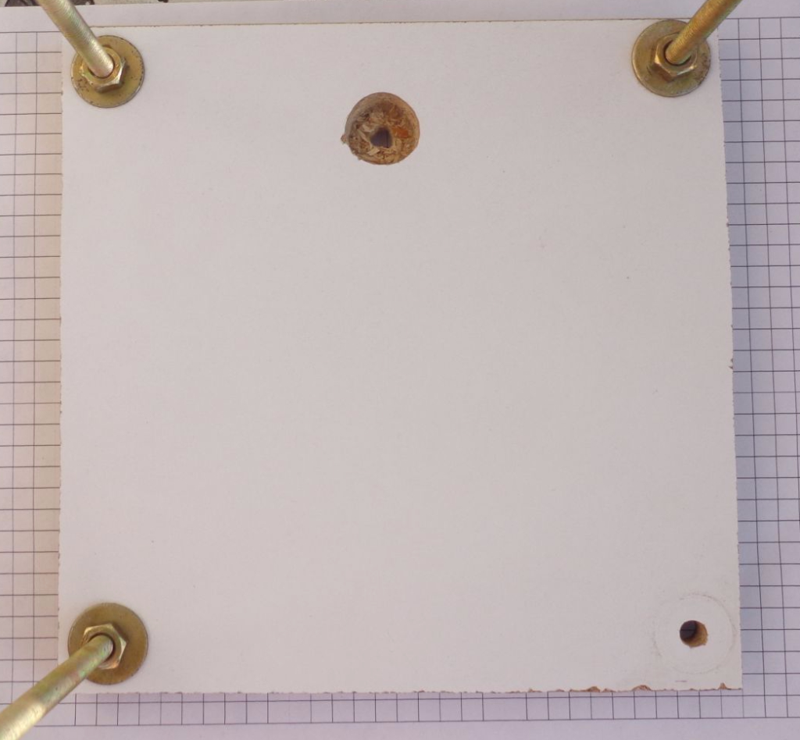
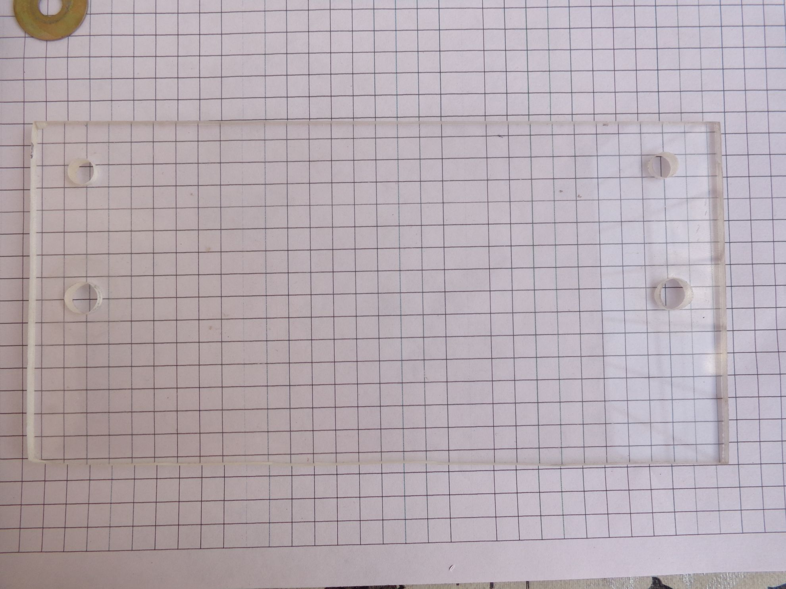
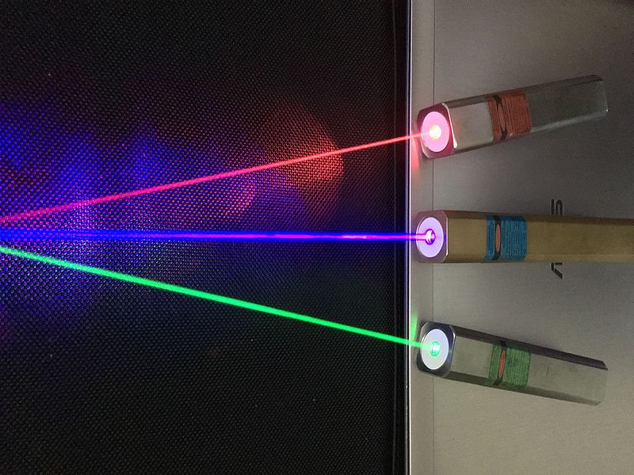
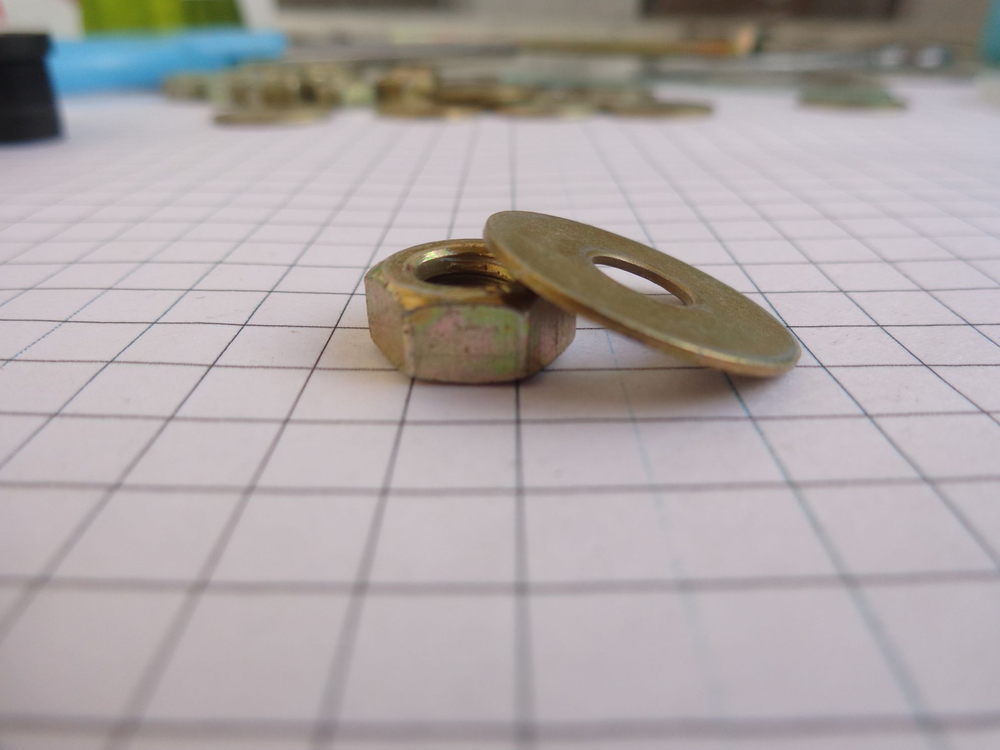
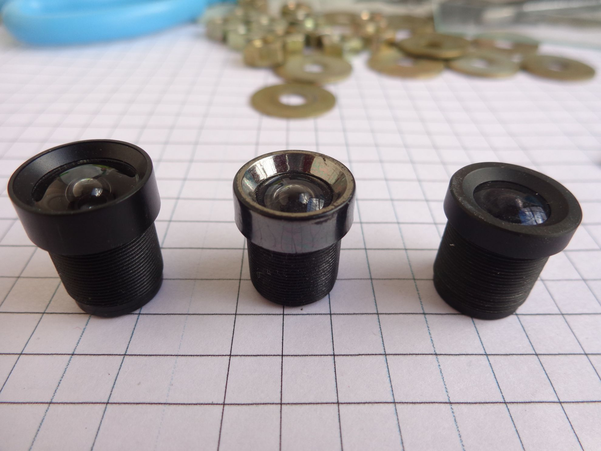
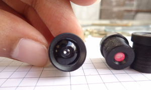
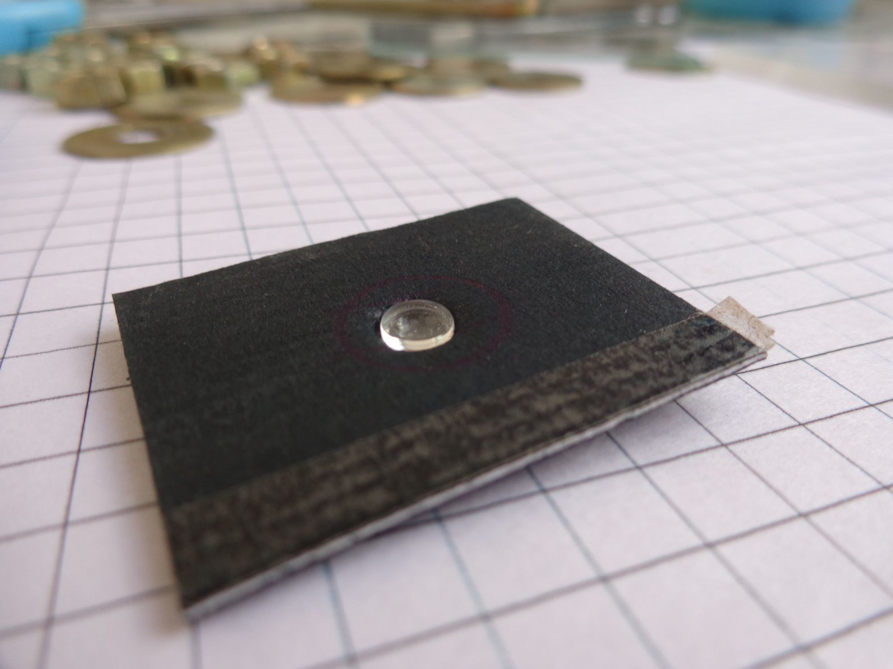
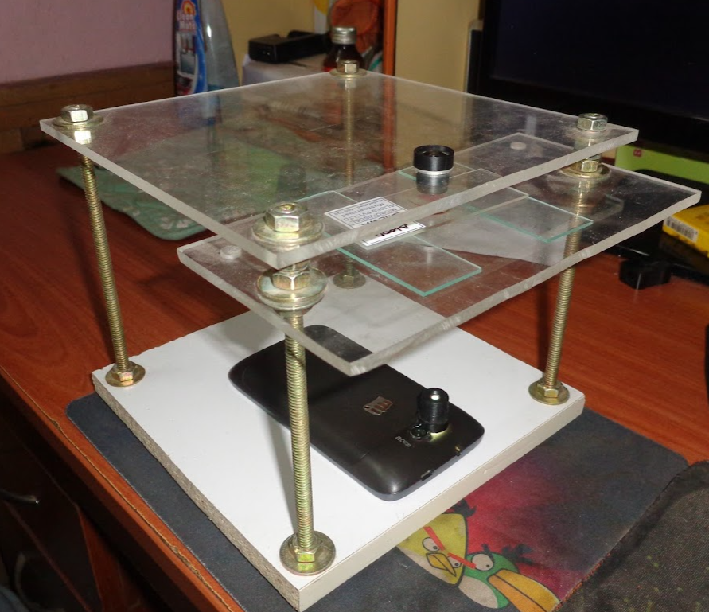

What tiny creatures are living in the street puddles or pond water where you live? You can discover them for yourself using a smartphone and some tinkering!

# Requirements:

- Webcam - Lens
- Laser Pointer (Optional)
- Acrylic Plastic Sheets (X2)
- 1-inch thick Wooden Slab for base
- Washer
- Nuts
- Large Screws (X4)
- Microscope Slides
- Microscope Cover Slips

## Procedure:
Step 1:
Cut the wooden slab as per these dimensions. This will serve the base for our DIY Microscope.

*Base DIY Microscope*

Step 2:
Now that our base is complete. We can cut the Acrylic Plastic Sheets as per dimensions given below.

Step 3:
It's now complete except the lens. It's important to choose the right lens. There are many sources that can give good results. A few are listed below:

- Webcam's isolated Lens
- Laser Pointer's Lens
- Glass Bead

[You can achieve a near 1000X with the Glass Bead.](https://gizmodo.com/how-to-make-a-1000x-microscope-with-your-phone-and-a-gl-1637657712)

Webcams are a common product these days and finding a used one shouldn't be difficult. Regardless the type of webcams, the removal process remains the same in all cases. The Lens is to be unscrewed from the webcam casing.

Step 4:
Add the lens bead.

Step 5:
Final Assembly

## Few examples:

## Gallery:

