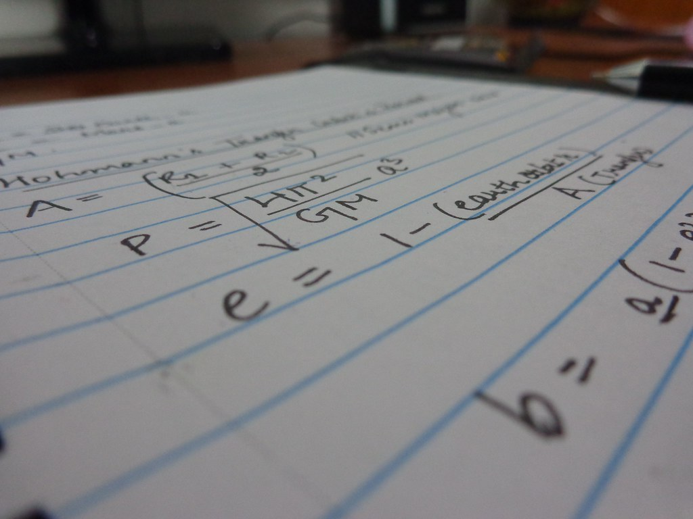
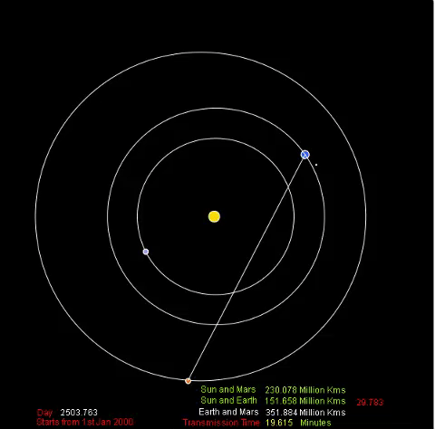
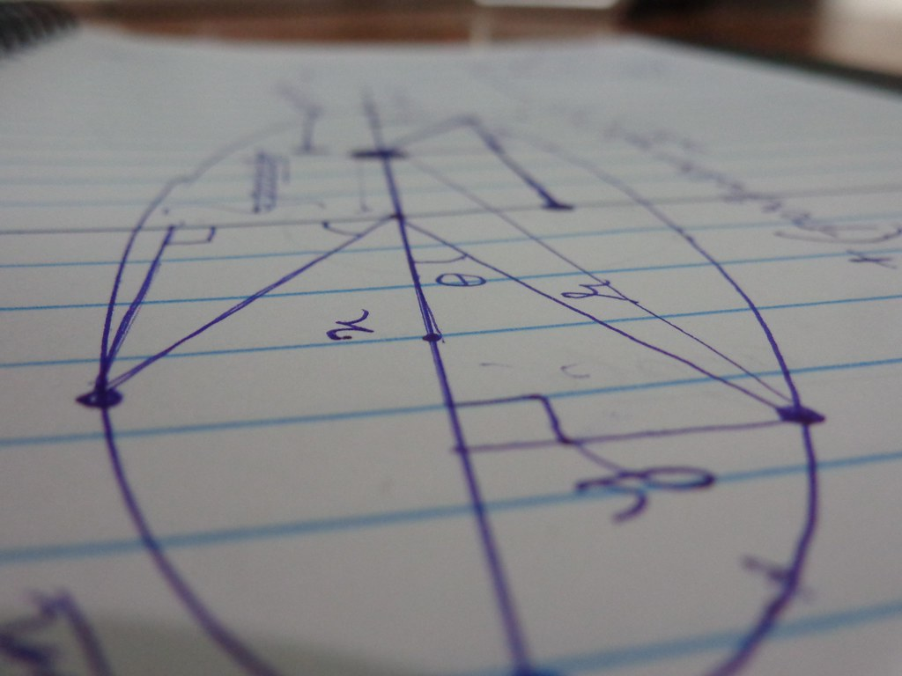

## What is it?

This is a Solar System Simulator. It simulates the motion of planets in realtime using some pretty complex maths and also is able to plan **interplanatry missions** _(not yet)_

[LINK TO PROGRAM](https://curious-nikhil.github.io/Solar-System-Simulator/SSS_V5.0_Hohmanns%20Transfer/)



## Why am I doing it?

Am a big fan of space flight and the journey it has still to cover. **Nasa's Curiosity Rover** or **ISRO's Martian Orbital Mission** truely inspired me,of how a group of like minded people can set out to do something impossible on the face of the planet.I love reading books, especially sci fi books, one of favourite is [The Martian](https://www.goodreads.com/book/show/18007564-the-martian). Andy Weir the author of **The Martian**, used a physics simulator to simulate the motion of his fictional ship (Ares V) with respect to earth and mars, so that he could write in accurate dates in his book *(Watch the video below for more context)*

<div style="position: relative; width: 100%; max-width: 100%; padding-bottom: 56.25%; height: 0;">
  <iframe
    src="https://www.youtube-nocookie.com/embed/gMfuLtjgzA8?si=YAn3eVQCfFAnaX6O&amp;start=820"
    title="YouTube video player"
    frameborder="0"
    allow="accelerometer; autoplay; clipboard-write; encrypted-media; gyroscope; picture-in-picture; web-share"
    referrerpolicy="strict-origin-when-cross-origin"
    allowfullscreen
    style="position: absolute; inset: 0; width: 100%; height: 100%;"
  ></iframe>
</div>

That was the starting point of this project. Back then, it didnt make any sense to start learning programming, but now since I had a goal to achieve, everything was different. _Rest is history..._

Why build a Solar System Simulator, in the first place, right? Why fuss over, complex Javascript Programming language when there are tonnes of way better software that simulate the universe, like [Stellarium](https://stellarium.org/) and [NASA’s Eye](https://eyes.nasa.gov). The answer to this is simple - it is the very fundamental character of human - DIY Life. 

I love making things on my own, and I feel everyone feels the same way unless you are lazy. By doing projects as such, you are bound to change your perspective of the world, as you stop taking things for granted. When you programme something as COOL as this, you are stepping into a new world.

## How does it work?


> That's a great question!

There are two way to build one of these sims _(simulators)_: **Accurate** and **not so accurate**.
Well I started of with the formal, and ever since have transversed to the latter eventually. I would **recommend**, building a **simple** planetary orbit first to understand the basic of programming and polar to cartesian coordinate conversions._(I am still a beginner)_
Yet, below is complete _breakdown_ of how it works.


---


---

## Version History

**Version 1 - MAY 2017**

**Version 2 - JULY 2017**

**Version 3 - SEP 2017**

**Version 4 - Jan 2018**

---

### BUGS

- [ ] Call parameters from a object into a protyotype function
- [ ] Planet not moving in desired path
- [ ] hx and hy are wrong
- [ ] Slight error in true anomaly
- [ ] Need to check the range of orbit radius
- [x] Uncaught Reference - Function (partially solved)

### WHAT TO DO?

- [x] A Universal Planet Function
- [x] ES5 vs ES6
- [ ] Hohmann's Transfer Orbit Trajectory
- [ ] Launch Window Calculations
- [ ] GUI for Information Center
- - [ ] GUI - Sliders
- [ ] Zoom out Function
- [ ] Scaled Objects
- [ ] Scenes
- - [ ] Hohmans Transfer Orbit
- - [ ] Lunar Trans Orbit
- - [ ] Other Planets
- [ ] Zoom in Feature
- [ ] Vector Integration
- [ ] ~~JSON Integration~~
- [ ] ~~Gravity Simulation~~

### Ideas

- [ ] Put in vector images for planets
- [ ] Nu2 - Nu1 = 44 degrees for Hohmanns Tranfer
- [ ] How to find the angle between two planets
- [ ] Plan a mission to Mars
- [ ] Trans Lunar Orbit

### Inspiration

- [Hohmanns Transfer Postion](https://space.stackexchange.com/questions/4406/hohmann-transfer-equation-of-motion%5D)
- Calculate True Anomaly - [http://www.jgiesen.de](http://www.jgiesen.de/kepler/kepler.html)
- Calculation of Time:
- - [Number of days between two dates](https://stackoverflow.com/questions/542938/how-do-i-get-the-number-of-days-between-two-dates-in-javascript)
- - [Calculate Date by adding days to a Date](https://www.khanacademy.org/computer-programming/number-of-days-to-a-date-20/5153033213509632)
- [Calculate Position of Planets](https://aa.quae.nl/en/reken/hemelpositie.html) _Link might be insecure_
- [Help from Khan Academy Community](https://www.khanacademy.org/profile/curiousnikhil/projects)

## Milestones

- Hohmans Transfer Orbit
- Data Visualization


# Intro

So, maybe that’s not enough for you to step into programming simulation or just about anything that doesn’t fall in the mainstream category.

As with all things in nature, one can over complicate things or can choose to simplify the chaos. I, on the other hand, will give you two choices - EASY or HARD.

## Prerequisites

EASY

1. Trigonometry
2. Kepler’s Law
3. Off Course, Programming Javascript

This is recommended for people who are new to trigonometry and physics.

HARD

1. All that of EASY
2. Ellipse
3. Object Oriented Programming
4. J2000
5. Ephemeris
6. 3D Geometry

# Mechanical Basis of Solar System.

If it wasn’t for Nicolaus Copernicus, we would still believed in the Geocentric system. He formulated the model of the universe, where the Sun was in centre, instead of Earth, around which other planets revolved including Earth. It was not readily accepted, by people back in his time. But nowadays taken for granted. Copernicus’s discovery gave rise to the very start of Heliocentric Coordinate System, which is basically GPS for planets in real-time.

<div style="position: relative; width: 100%; max-width: 100%; padding-bottom: 56.25%; height: 0;">
  <iframe
    src="https://www.youtube-nocookie.com/embed/W3yv7ZNc6Ss?si=40HZIJCodNk6gOKj"
    title="YouTube video player"
    frameborder="0"
    allow="accelerometer; autoplay; clipboard-write; encrypted-media; gyroscope; picture-in-picture; web-share"
    referrerpolicy="strict-origin-when-cross-origin"
    allowfullscreen
    style="position: absolute; inset: 0; width: 100%; height: 100%;"
  ></iframe>
</div>

# EASY - Circular Orbits

It’s highly unlikely that you haven’t seen any pictures of our Solar System. Chances are, 99% of the pictures are depicted wrongly, where planets seem to be orbiting in circular orbits and seem so close to each other. These school - pictures of Solar System are not up to scale. This is inherently, invokes people’s perspective of how far or how big these planets are in reality.

Hence, I wanted to make it my utmost priority to take elliptical orbits into account. [To Know More](https://www.khanacademy.org/partner-content/nasa/measuringuniverse/orbital-mechanics/a/circular-orbits)

If you are a beginner and want to just quickly finish. Go with Circular Orbits.A [circle](https://upload.wikimedia.org/wikipedia/commons/0/03/Circle-withsegments.svg) is a simple closed shape in Euclidean geometry.It is the set of all points in a plane that is at a given distance from the centre point.

# What is a Cartesian Coordinate System?

Every object's location is defined in such a way that it’s in reference to a universal point.In the Cartesian system, a point on the plane is determined by the distance from the origin in the X - Axis and Y - Axis. So, the point is at ` (X, Y)`. For 3D environment - `(X, Y, Z)`.

# What is Polar Coordinate System?

Unlike, Cartesian System, a point in Polar Coordinate System is determined by a distance from a reference point and an angle from a reference direction.

Now, it’s just a matter of unifying all the coordinates from different systems. We are going to create our Solar System in a Cartesian Environment. So we need to know the **X** and **Y** coordinates of the planet that is orbiting around the sun in a circular fashion.

Let’s find the Polar Coordinates of the Point:

In the Given Triangle ABC,

- B is the origin(0, y)
- A is the point with unknown location.
- r is the radius of the circular orbit.
- ϴ is the angle the radius and the x axis.

sin(angle) = Opposite/Hypotenuse
cos(angle) = Adjacent/Hypotenuse

So, In triangle ABC,

$\angle ABC = \theta$

$\sin(\theta) = \frac{AC}{AB} = \frac{AC}{r}$

$\cos(\theta) = \frac{BC}{r}$

$\cos(\theta) = \frac{BC}{r}$

$BC = r\cos(\theta)$

Voila, $BC$ is the distance from the origin to the point in the X Axis and AC is the distance from the origin to the point in the Y Axis.

Therefore,

$X = r\cos(\theta)$

$Y = r\sin(\theta)$

As the planet orbits or revolves around our Sun, The Angle with respect to Sun keeps changing with respect to time. So, now all that we have to do is just make a program that can over time change the angle by a certain amount every second. There you go! that ‘s it! Wasn’t really that hard. We used basics of trigonometry and implemented in our program.

# Elliptical Orbits

# Orbital Mechanics in Code

Creating an Object is essential as you have to call them many times. 

```var earthX = sunX + orbitRadius*cos(angle); var earthY = sunX + orbitRadius*sin(angle);```

Finding X, Y and Z Coordinates of the Planet. 

```js
// X - COORDINATE
var hecX = function (hecR, omega, lcomega, hecnu, inclination) {
  var hecX =
    hecR(
      cos(omega) * cos(lcomega + hecnu) -
      sin(omega * cos(inclination) * sin(lcomega + hecnu))
    );
  return hecX;
};

// Y - COORDINATE
var hecY = function (hecR, omega, lcomega, hecnu, inclination) {
  var hecY =
    hecR(
      sin(omega) * cos(lcomega + hecnu) -
      cos(omega * cos(inclination) * sin(lcomega + hecnu))
    );
  return hecY;
};

// Z - COORDINATE
var hecZ = function (hecR, inclination, lcomega, hecnu) {
  var hecZ = hecR * sin(inclination) * sin(lcomega + hecnu);
  return hecZ;
};
```


# Glossary

## True Anomaly (ν )

The true anomaly ν [nu] is the angle between the line from the focus of the orbit (the Sun) to the perihelion of the orbit and the line from the focus to the planet. To calculate the true anomaly, you need to solve the Equation of Kepler.

For Jupiter, the true anomaly that goes with

- MJupiter=141.324°
- MJupiter=141.324° and
- eJupiter=0.04849 eJupiter=0.04849 is equal to νJupiter=144.637°
- νJupiter=144.637°.

For the Earth, the true anomaly that goes with

- MEarth=357.009°
- MEarth=357.009° and
- eEarth=0.01671
- eEarth=0.01671 is equal to νEarth=356.907°
- νEarth=356.907°.

# Inclination (i)

In astronomy, inclination is an angle between some direction and a standard plane. Inclination is used as name for

the angle between the orbit of a planet or other celestial body and the base plane of the coordinate system (usually the ecliptic for bodies in the Solar System). The inclination is one of the orbital elements.
the angle that the magnetic field makes with the local surface.
